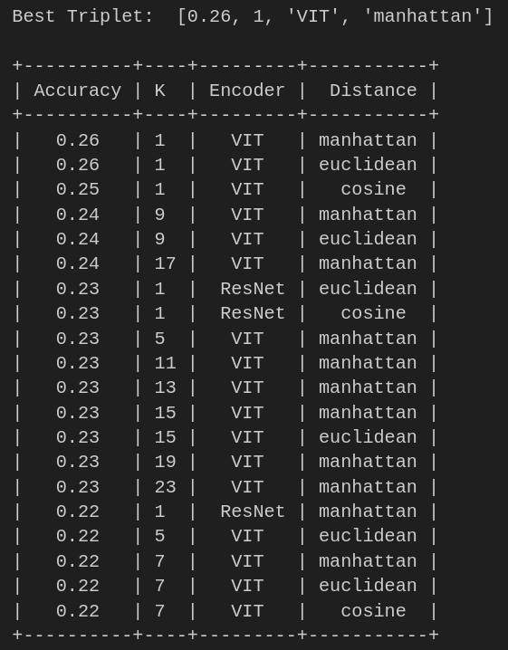
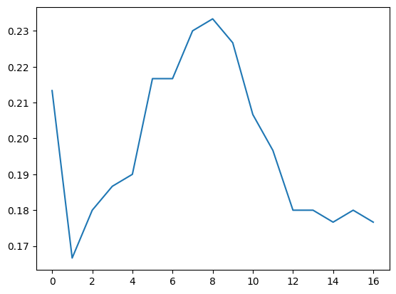
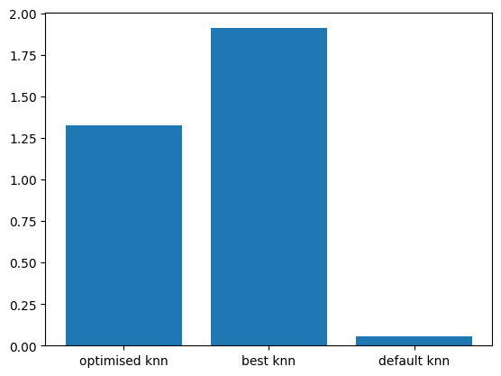
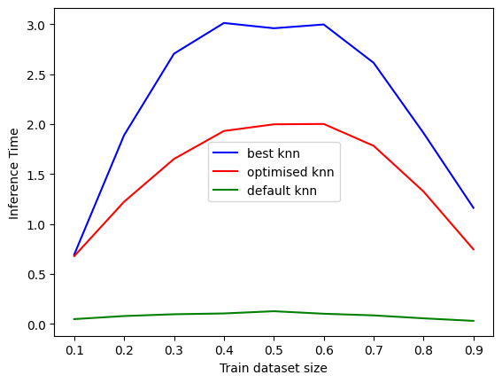
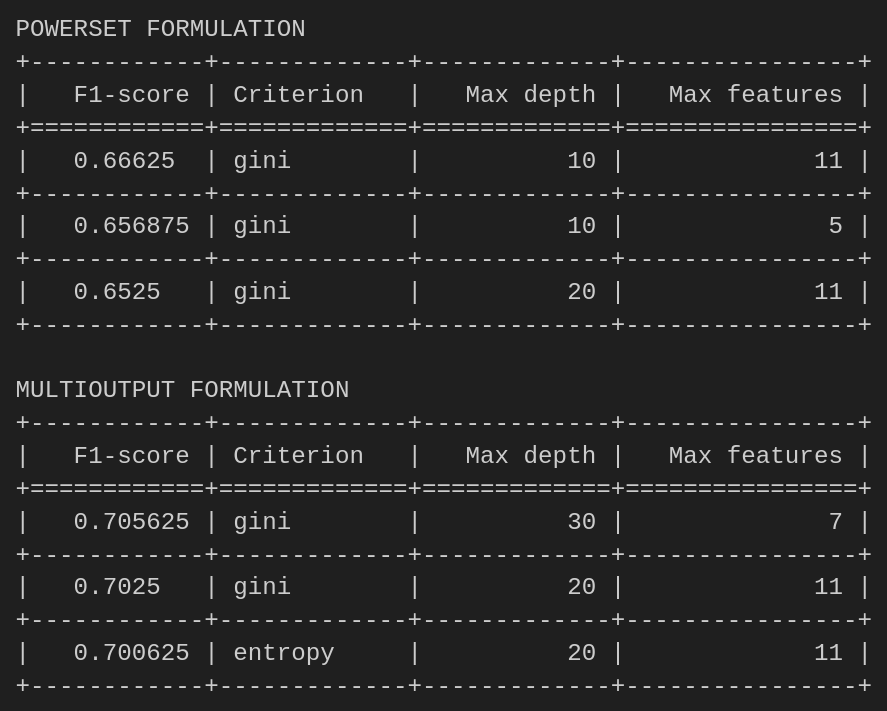

> ### Name: Amogha A Halhalli
> ### Roll No: 2021101007

K Nearest Neighbours
----

### Section 2.1: Pictionary Dataset
Loaded the dataset from data.npy file and analysed through the data.

### Section 2.2: Exploratory Data Analysis
Implemented a graph that shows the distribution of the various labels across the entire dataset using Matplotlib.

### Section 2.3: KNN Implementation
- Created a class for KNN which takes train data, k value, encoder type and distance metrics as parameters.  
- Split the entire dataset into train data and test data with train size=0.8  
- Implemented the set methods to modify the value of k, encoder type and distance metrics.  
- Calculated the f-1 score, accuracy, precision, and recall using sklearn metrics.  
- Used average='weighted' and zero_division=0 to calculate f-1 score, precision and recall.  

### Section 2.4: Hyperparameter Tuning
- Found out the best triplet (k, encoder type, distance metric) by recursing through all the triplets possible.  
- Sorted the triplets based on the accuracy and found the list of top 20 such triplets.  
- Plotted the k vs accuracy graph with VIT as encoder type and manhattan as the distance metric.  
- Used the standard library Matplotlib to construct the plots.  

### Section 2.5: Testing
- Created a bash script that takes the path of a test file as first arguement for testing.  
- It prints the accuracy, f1-score, recall and precision of the test data in a table.  
- Assuming the train and test file contain the data in the same pattern as in data.npy file.  
- The path to the train file can also be stated as the second argument for the bash script.  
- If second arguement is not stated, it assumes train file as the existing data.npy in the current directory.  
- The bash script in turn runs the check.py file to calculate the scores. Do not move or modify the check.py file.  
- Proper error handling is done for any of the absence files or wrong names of the files.  
- Using k=7, VIT as encoder type and manhattan as distance metric in this bash script.  

### Section 2.6: Optimization
- Initial time Complexity is O(1) for training and O(Nd+NlogN) for testing.  
- Then used heap, while testing, in order to minimise the overall time complexity of the algorithm.  
- Improved the execution time of the program by using vectorization done by implementing numpy arrays.  
- Initial KNN model and the most optimized KNN model are the same initial implementation of the algorithm.  
- Best KNN model is the model which has maximum accuracy and most optimized KNN model is the one which takes least time to run.  

Decision Tree
----

### Section 3.1: Data Exploration
1. Data visualization and exploration  
Throughly went through all the attributes of the given dataset.  
Found out the number of unique labels and the attributes which should be encoded.  

2. Data preprocessing  
Used multi-label binarizer to encode the labels.  
Used one-hot encoding to encode the categorial variables.  

3. Data featurization  
Found out the city attribute has almost unique values in each sample.  
Attributes as such can be dropped in order to avoid the overhead of many features created by one-hot encoding.  

4. Train-test splitting  
Initially split the entire data into X and Y(labels).  
Then, split each X and Y into train data and test data with train size=0.8  

### Section 3.2 Decision Tree
Loaded the dataset form the provided file advertisement.csv using pandas.

### Section 3.3: MultiLabel Classification
- Created a class for the Decision Tree which takes criterion, max depth and max features as parameters. 
- Implemented the set methods to modify the value of criterion, max depth and max features.  
- Used the inbuilt sklearn decision tree in order to build the Decision Tree Classifier.  
- Implemented the Powerset Formulation using the LabelPowerset function.  
- Implemented the MultiOutput Formulation using the MultiOutputClassifier function.  

### Section 3.4: Hyperparameter Tuning
- Reported Accuracy, F1(micro and macro), Precision and Recall scores for all possible triplet of hyperparamters for both Powerset and MultiOutput Formulation.
- The files powerset.txt and multioutput.txt files contains the above scores for the corresponding Powerset formulation and Multioutput formulation.  
- Implemented the pooled confusion matrix in order to avoid multiple matrixes. 
- Using Hamming loss to calculate the accuracy instead of accuracy_score.
- Ranked the top 3 performing set of hyperparamters according to F1-Score(macro) for both Powerset and MultiOutput Formulation.
- Implemented the K fold validation metrics with the value of K being 8. 

